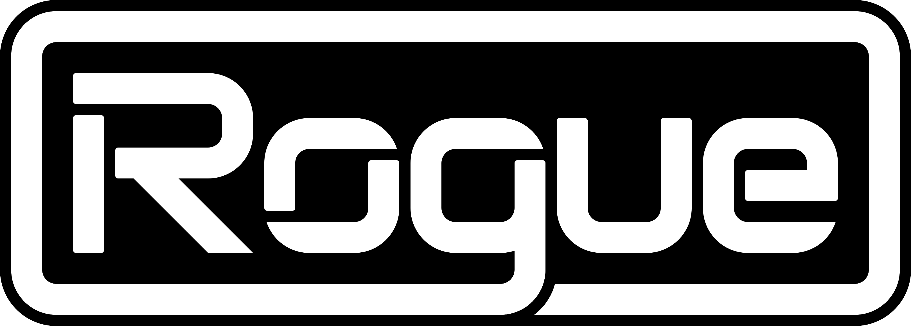

# Rogue
An ergonomic object-oriented high-level language that compiles to C.

About     | Current Release
----------|-----------------------
Version   | 2.39
Date      | April 22, 2025
Platforms | Windows, macOS, Linux
License   | [MIT License](LICENSE)

Note: Rogue v1.x is available in the `v1` branch.

# Installation

## Morlock Install (Simplest)
Install [Morlock](https://morlock.sh).

Installing Morlock will also install Rogue and [Rogo](https://github.com/brombres/Rogo).

## Manual Install
1. Clone this repository locally.
2. Run `make`.

# Documentation and Examples

[API documentation](https://github.com/brombres/Rogue/wiki/API), a [syntax guide](https://github.com/brombres/Rogue/wiki/Syntax), and the source for various Rogue-based [utilities](https://github.com/brombres/Rogue/wiki/Written-in-Rogue) can be found on the [wiki](https://github.com/brombres/Rogue/wiki).

# Syntax Highlighting

## Visual Studio Code

Rogue comes with a work-in-progress VS Code extension which can be found in the `Syntax/VSCode` folder.

## Vim

Rogue comes with syntax and indent modules for Vim; they are located in the Syntax/Vim folder.

### Notes

1. `roguec` by itself for options.

2. Execute these shell commands for a simple test:

#### Mac/Linux

        echo println '"Hello World!"' > Hello.rogue
        roguec Hello.rogue --main && cc Hello.c -o hello && ./hello

#### Windows

        echo println "Hello World!" > Hello.rogue
        roguec Hello.rogue --main && cl Hello.c && .\Hello.exe

# License
Rogue is released under the terms of the [MIT License](https://opensource.org/licenses/MIT).

# About
Brom Bresenham created Rogue in 2015 and leads Rogue's design and development.

